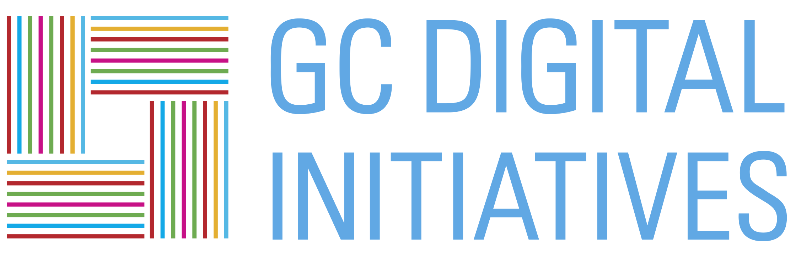

```{r setup, include=FALSE}
knitr::opts_chunk$set(echo = TRUE, fig.align="center")
htmltools::tagList(rmarkdown::html_dependency_font_awesome())
```

{#header .header}

This project is part of a collaboration by several [Digital Fellows](https://digitalfellows.commons.gc.cuny.edu/) of the [Graduate Center Digital Initiatives](https://gcdi.commons.gc.cuny.edu/). Our efforts were initiated in light of the recently proposed budget by the Trump administration that called for the elimination of the National Endowment of Humanities (NEH) and the National Endowment of the Arts (NEA).

All the code for this project are available on Github at [GCDigitalFellows/visualizing-neh](https://github.com/GCDigitalFellows/visualizing-neh). If you have any issues with the data or presentation, please [submit issues](https://github.com/GCDigitalFellows/visualizing-neh/issues/new) through Github.

Contributors:

* [Tahir Butt](https://github.com/majorgreys)
